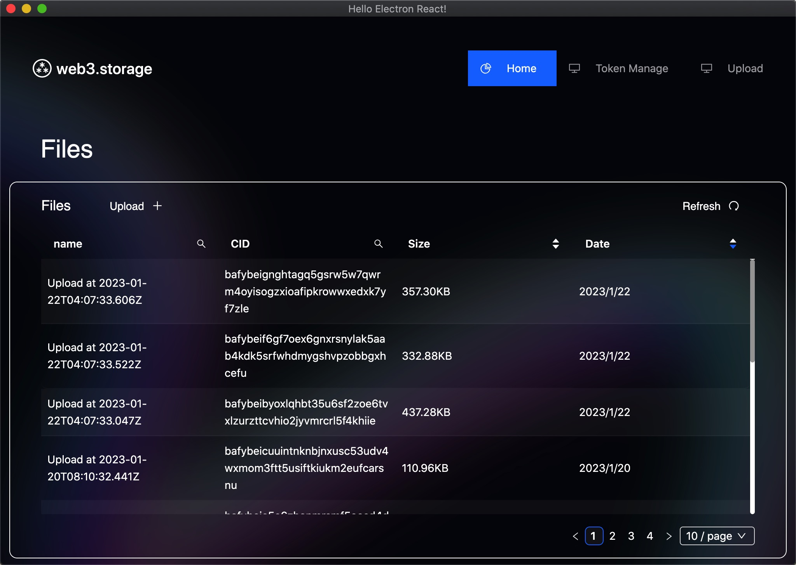
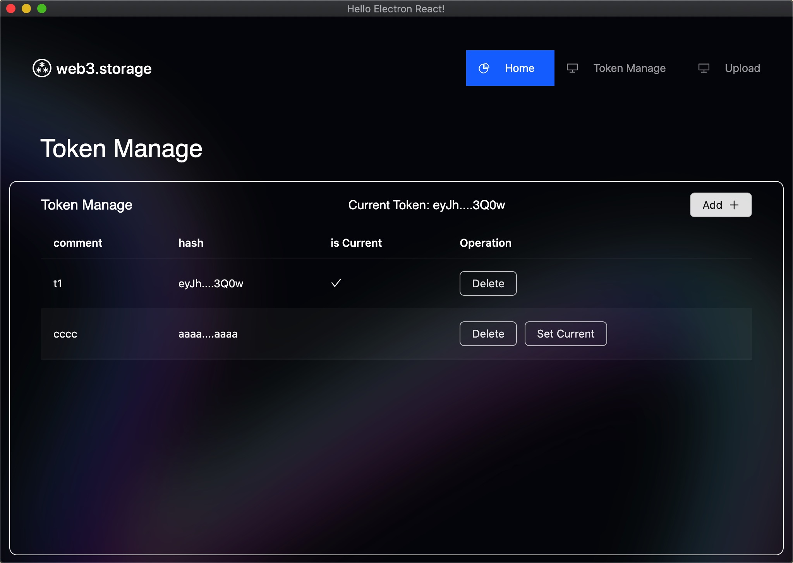
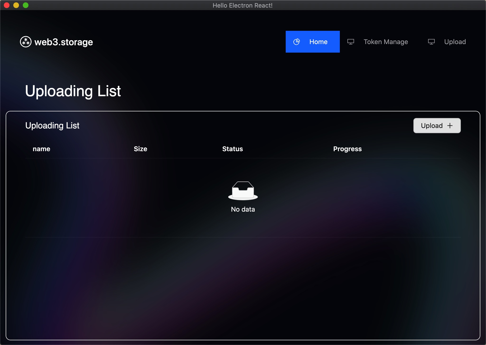

# web3.storage desktop client

When i use <a href="https://web3.storage" _target="blank"> web3.storage </a> to upload a file in browser, I found it is not very convenience, so there is a desktop version.

This client use api token generate on <a href="https://web3.storage" _target="blank"> web3.storage </a>

once you set a validate api token in this client, you can upload files to web3.storage, it is easy to use.

